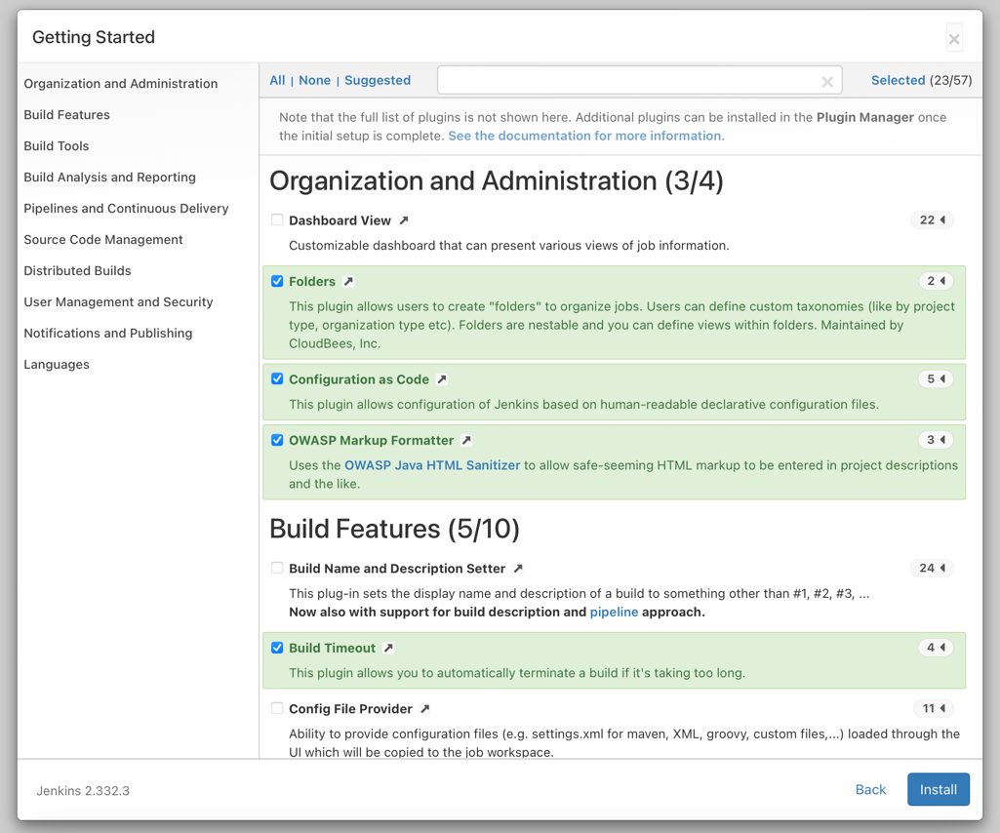
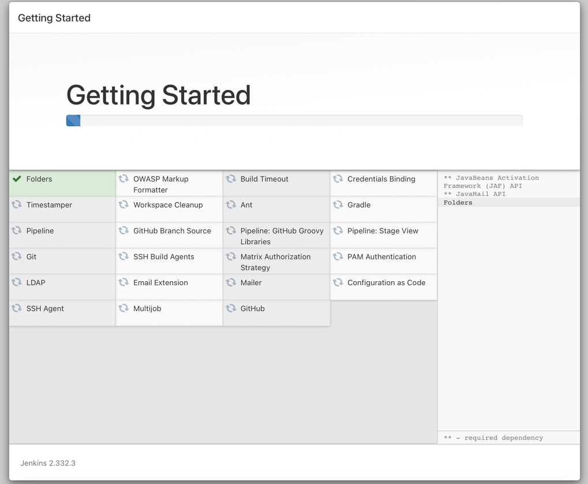
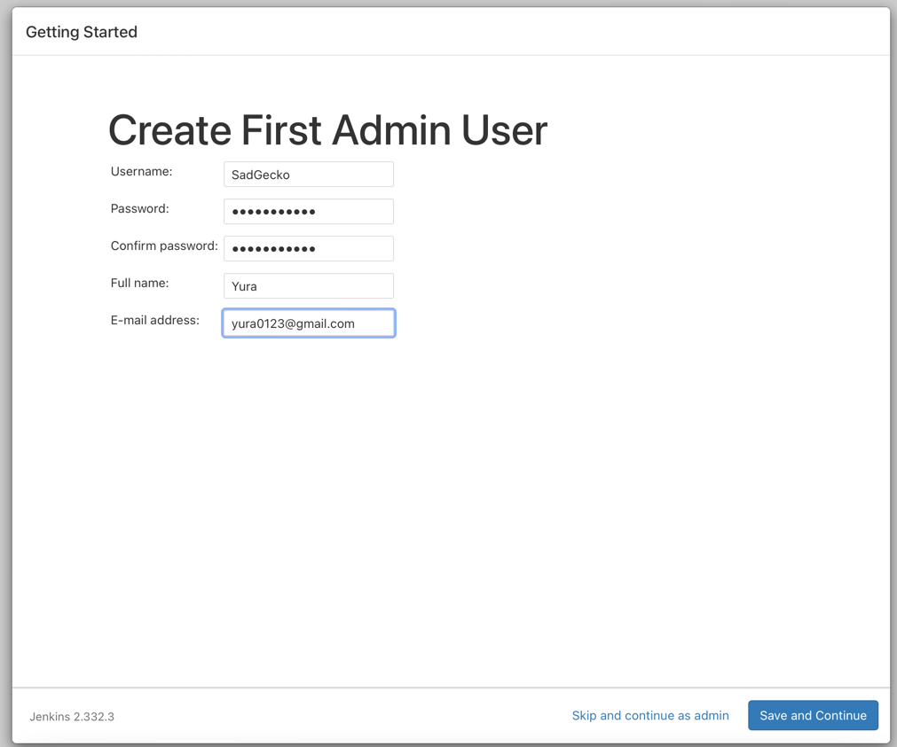
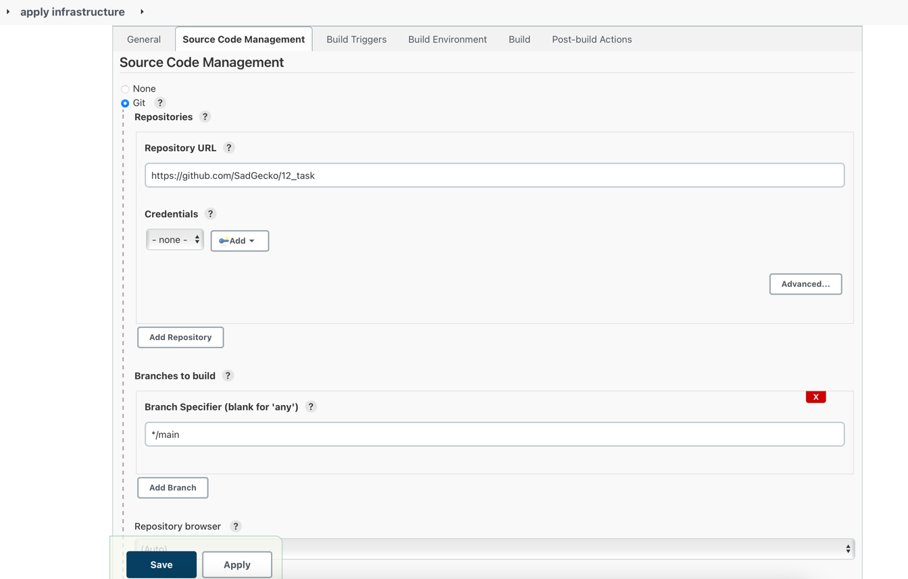
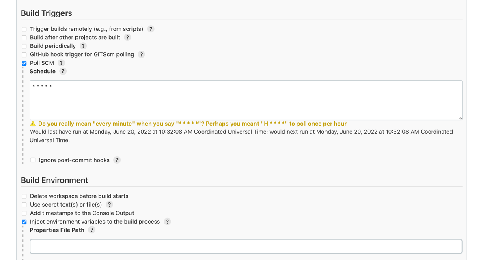
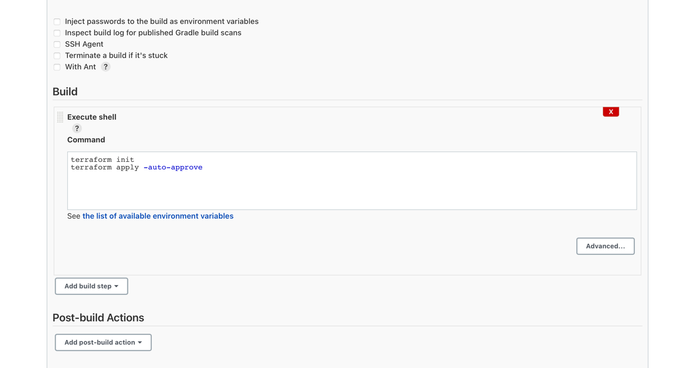
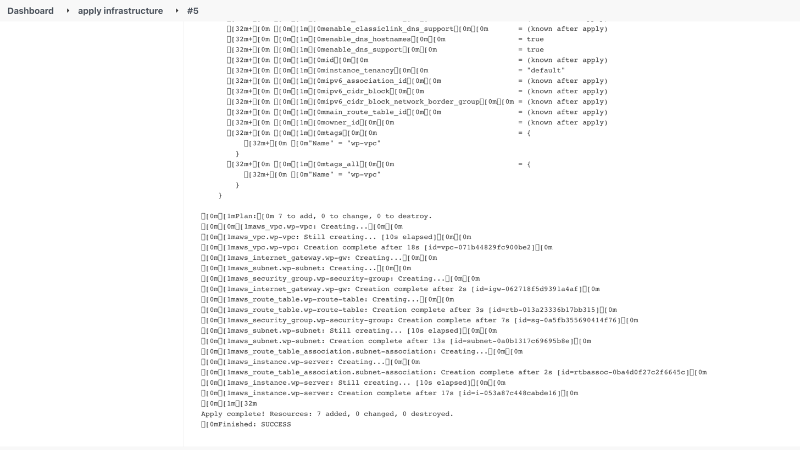
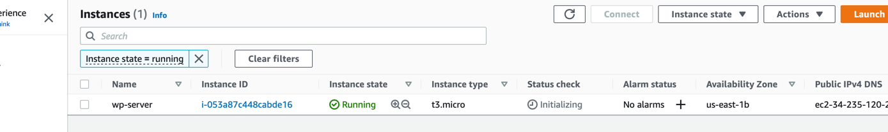

# Встановлення Jenkins

Встановлено Java необхідну для роботи Jenkins
~~~
sudo apt update && sudo apt install openjdk-11-jre
~~~

Встановлено Jenkins командами
~~~
curl -fsSL https://pkg.jenkins.io/debian-stable/jenkins.io.key | sudo tee /usr/share/keyrings/jenkins-keyring.asc > /dev/null
echo deb [signed-by=/usr/share/keyrings/jenkins-keyring.asc] https://pkg.jenkins.io/debian-stable binary/ | sudo tee /etc/apt/sources.list.d/jenkins.list > /dev/null
sudo apt update && sudo apt install jenkins
~~~

Далі із файлу `/var/lib/jenkins/secrets/initialAdminPassword` вставлено ключ для активації Jenkins

Встановлено необхідні плагіни:

Створено пайплайн якій опитує git та виконує код у випадку коли, щось змінилось то Jenkins запускає пайплайн.

